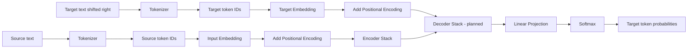
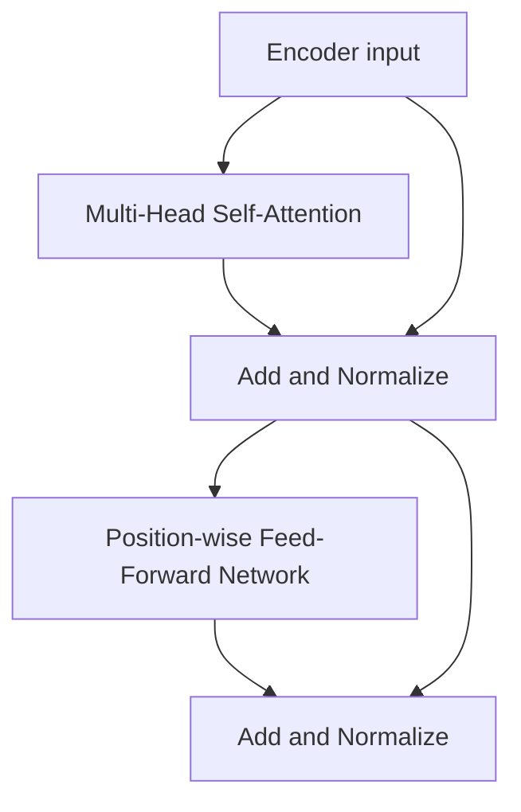
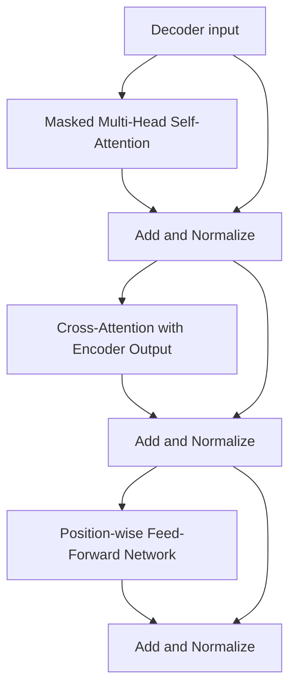

# Transformer Architecture

A step-by-step, object-oriented implementation of the original Transformer architecture using Python and PyTorch.

This project is a learning-focused implementation of the Transformer described in *Attention Is All You Need*. Each major stage of the architecture is implemented in its own Python file so that the individual components can be understood, tested, and combined.

> **Project status:** The encoder-decoder architecture is runnable. The included `transformer.py` trains on one short English-to-French example and tests greedy autoregressive translation.

## What This Project Demonstrates

The implementation uses object-oriented programming to model Transformer components as reusable classes. Each class owns its parameters and forward-pass behavior, while PyTorch's `nn.Module` provides the common foundation for trainable neural-network components.

The current implementation includes:

- A central `config.py` file for shared Transformer hyperparameters
- A `WordTokenizer` wrapper around GPT-2 `tiktoken` for converting text into token IDs
- An `InputEmbedding` class for converting token IDs into vector representations
- A `PositionalEncoding` class for adding token-order information
- Multi-head self-attention
- Residual connections and layer normalization
- A position-wise feed-forward network using GELU
- A configurable stack of encoder layers
- A runnable `TransformerEncoder` entry point

Shared dimensions and hyperparameters are intended to come from `config.py`, allowing the individual modules to work together consistently as the project grows.

## Transformer Architecture Flow

The original Transformer has an encoder-decoder structure. The source sequence enters the encoder, the target sequence enters the decoder during training, and the decoder produces a probability distribution over the target vocabulary.



### Encoder block flow



### Decoder block flow



## Current Files

| File | Responsibility | Status |
| --- | --- | --- |
| `config.py` | Shared vocabulary sizes, model dimensions, layer counts, sequence length, and dropout | Available |
| `check_env.py` | Checks Python, PyTorch, and CUDA availability | Available |
| `input_embedding.py` | Tokenization and input embedding classes | Complete |
| `positional_encoding.py` | Sinusoidal positional encoding | Complete |
| `Multiheadattention.py` | Multi-head self-attention | Complete |
| `AddNorm.py` | Residual connection followed by layer normalization | Complete |
| `MLP.py` | Position-wise feed-forward network | Complete |
| `Encoder_block.py` | Encoder layer and configurable encoder stack | Complete |
| `self_attention.py` | Scaled dot-product attention foundation | Available |
| `MaskMHA.py` | Masked multi-head attention | Complete |
| `CrossAttention.py` | Decoder-to-encoder cross-attention | Complete |
| `Decoder_block.py` | Decoder layer and configurable decoder stack | Complete |
| `transformer.py` | Full model, toy training loop, and greedy translation test | Complete |

## End-to-End Translation Demo

Run the complete toy translation experiment with:

```bash
python transformer.py
```

The script uses the GPT-2 subword vocabulary and makes the learning target
explicit:

```python
source_text = "i like apples"
target_text = "j aime les"
target_word = "pommes"
```

It trains with teacher forcing to predict `target_word` after `target_text`,
then predicts the complete French sequence autoregressively.
It is intentionally a one-example overfitting test of the architecture, not a
general-purpose translation system.

Possible future files include:

```text
layer_normalization.py
feed_forward.py
multi_head_attention.py
encoder_layer.py
encoder.py
decoder_layer.py
decoder.py
projection.py
transformer.py
masks.py
train.py
inference.py
```

The exact file structure may evolve as each component is implemented and tested.

## Configuration

The main model parameters are defined in `config.py`:

- Source and target vocabulary sizes
- Embedding dimension, `d_model`
- Number of attention heads
- Number of encoder and decoder layers
- Feed-forward hidden dimension, `d_ff`
- Maximum sequence length
- Dropout probability

`TransformerEncoder` uses these values by default, and each value can be overridden through its constructor. Individual modules import the shared values so the components remain compatible as they are connected.

## Setup

Create or activate a Python environment, then install the required packages:

```bash
pip install torch tiktoken matplotlib
```

Check the environment with:

```bash
python check_env.py
```

Run the completed encoder with:

```bash
python Encoder_block.py
```

The built-in smoke test tokenizes `This is our Transformer first layer`, runs it through the encoder, and prints output similar to:

```text
Encoder output shape: torch.Size([1, 7, 512])
```

The first dimension is the batch size, the second is the token sequence length, and the final dimension is `d_model`.

## Learning Goal

The purpose of this project is not only to produce a working Transformer, but also to understand how the architecture is constructed from smaller object-oriented components. The completed encoder provides the first end-to-end path from text to contextualized representations; future decoder work will extend it into the complete Transformer model.
