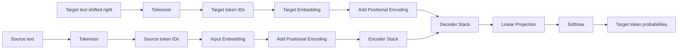
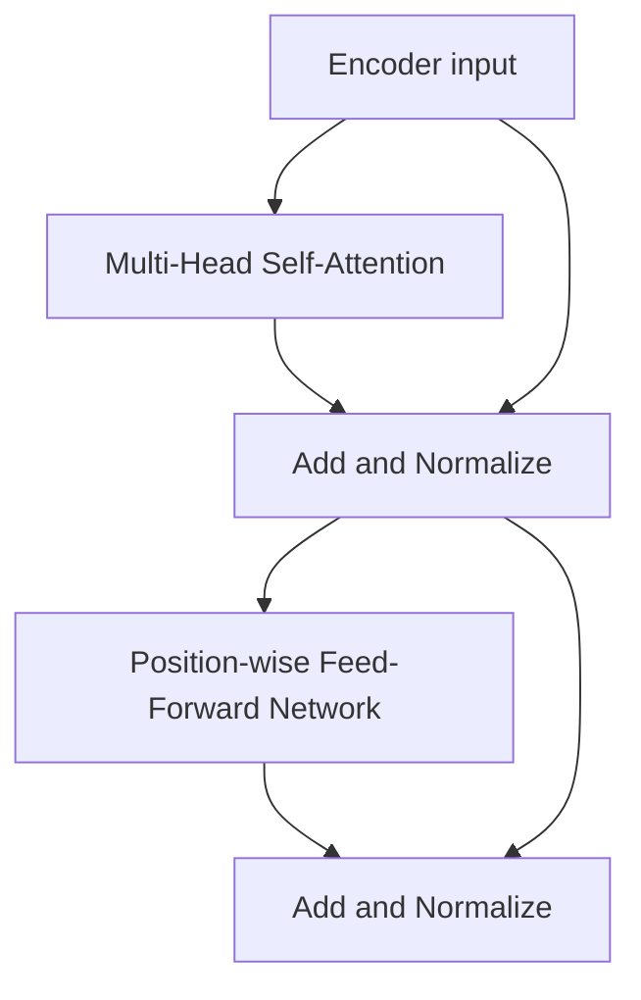
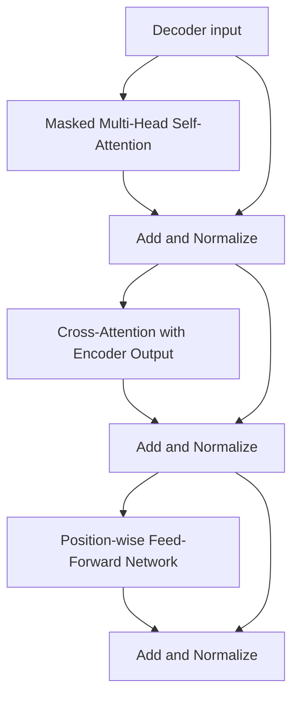

# Transformer Architecture

A step-by-step, object-oriented implementation of the original Transformer architecture using Python and PyTorch.

This project is being developed as a learning-focused implementation of the Transformer described in *Attention Is All You Need*. Each major stage of the architecture will be implemented in its own Python file so that the individual components can be understood, tested, and combined into a complete encoder-decoder model.

> **Project status:** This architecture is still under development. The current repository contains the initial building blocks; the complete Transformer has not been finished yet.

## What This Project Demonstrates

The implementation uses object-oriented programming to model Transformer components as reusable classes. Each class owns its parameters and forward-pass behavior, while PyTorch's `nn.Module` provides the common foundation for trainable neural-network components.

The current design includes:

- A central `config.py` file for shared Transformer hyperparameters
- A `Tokenizer` class for converting text into token IDs
- An `InputEmbedding` class for converting token IDs into vector representations
- A `PositionalEncoding` class for adding token-order information
- An initial `ScaledDotProductAttention` class for calculating attention scores
- Separate files for each stage so the architecture can be assembled progressively

Shared dimensions and hyperparameters are intended to come from `config.py`, allowing the individual modules to work together consistently as the project grows.

## Transformer Architecture Flow

The original Transformer has an encoder-decoder structure. The source sequence enters the encoder, the target sequence enters the decoder during training, and the decoder produces a probability distribution over the target vocabulary.



### Encoder block flow



### Decoder block flow



## Current Files

| File | Responsibility | Status |
| --- | --- | --- |
| `config.py` | Shared vocabulary sizes, model dimensions, layer counts, sequence length, and dropout | Started |
| `check_env.py` | Checks Python, PyTorch, and CUDA availability | Available |
| `input_embedding.py` | Tokenization and input embedding classes | Started |
| `positional_encoding.py` | Sinusoidal positional encoding | Started |
| `self_attention.py` | Scaled dot-product attention foundation | Started |

## Planned File-by-File Development

The remaining architecture will be added as individual modules rather than one large file. The planned progression is:

1. Complete multi-head attention
2. Add layer normalization, residual connections, and dropout
3. Implement the position-wise feed-forward network
4. Build an encoder layer and stack multiple encoder layers
5. Build a decoder layer with masked self-attention and cross-attention
6. Stack multiple decoder layers
7. Add the final linear layer and softmax output projection
8. Combine the encoder and decoder into a complete `Transformer` class
9. Add masking, loss calculation, training, evaluation, and inference

Possible future files include:

```text
layer_normalization.py
feed_forward.py
multi_head_attention.py
encoder_layer.py
encoder.py
decoder_layer.py
decoder.py
projection.py
transformer.py
masks.py
train.py
inference.py
```

The exact file structure may evolve as each component is implemented and tested.

## Configuration

The main model parameters are defined in `config.py`:

- Source and target vocabulary sizes
- Embedding dimension, `d_model`
- Number of attention heads
- Number of encoder and decoder layers
- Feed-forward hidden dimension, `d_ff`
- Maximum sequence length
- Dropout probability

Individual modules should import these shared values instead of defining conflicting local values. This keeps the components compatible when they are connected into the final Transformer architecture.

## Setup

Create or activate a Python environment, then install the required packages:

```bash
pip install torch tiktoken matplotlib
```

Check the environment with:

```bash
python check_env.py
```

Run an individual component with:

```bash
python input_embedding.py
```

## Learning Goal

The purpose of this project is not only to produce a working Transformer, but also to understand how the architecture is constructed from smaller object-oriented components. As development continues, each file will represent one understandable part of the computation, and the final `Transformer` class will compose those parts into the complete model.
